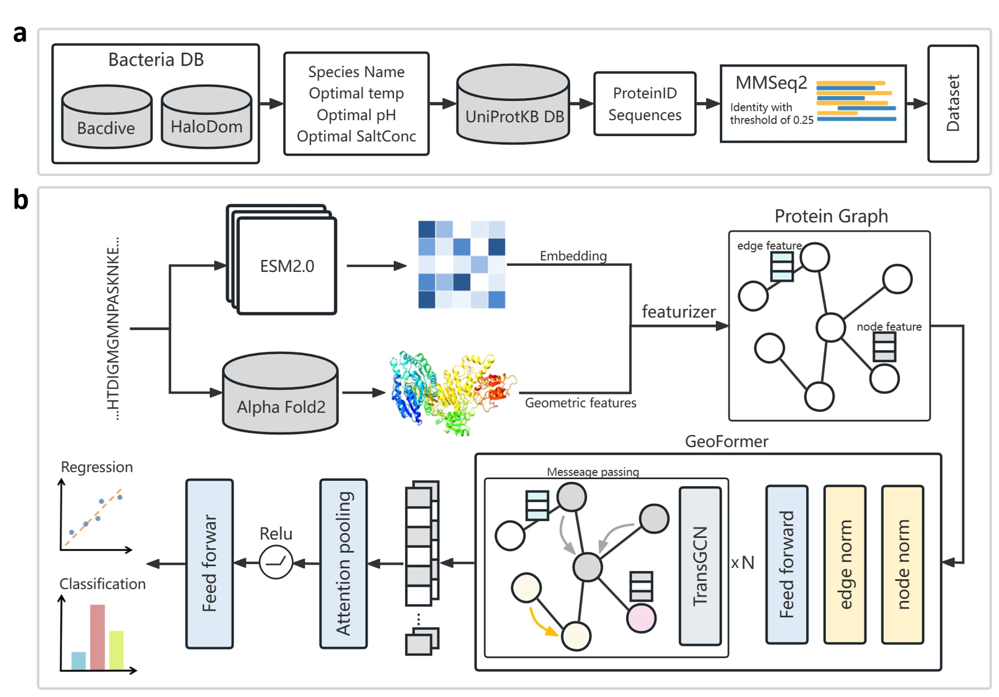

# Intoduction
Here, we proposed an up-to-date dataset consisting of tree tasks (temperature, pH, salt concentration) and a protein optimal condition predictor GeoPoc. GeoPoc is a geometry-aware network for simultaneously predicting protein optimal temperature, pH, and salt concentration. GeoPoc leverages AlphaFold-predicted protein structures and sequence embeddings extracted from a pre-trained language model and further employs a geometric graph transformer network to capture the structure and sequence features. GeoPoc is easy to install and run, and is also fast and accurate (surpassing state-of-the-art methods).


# System requirement
GeoPoc is mainly based on the following packages:
- python 3.8.18
- numpy 1.24.3
- pandas 2.0.3
- pytorch 1.12.0
- pytorch-cluster 1.6.3
- pyg 2.4.0
- pytorch-scatter 2.1.2
- biopython 1.81
- fair-esm 2.0.0
- dllogger 1.0.0
- openfold 1.0.1
- sentencepiece 0.1.99
- transformers 4.30.1

# install and set up GeoPoc
1. Clone this repository by `git clone https://github.com/ZhummCrow/GeoPoc.git`
2. Install the packages required by GeoPoc. To use [ESMFold](https://github.com/facebookresearch/esm) model, specially you can install GeoPoc according to the following instructions.
```bash
pip install "fair-esm[esmfold]"
pip install 'dllogger @ git+https://github.com/NVIDIA/dllogger.git'
pip install modelcif==0.7
```
Moreover, download the [openfold](https://github.com/aqlaboratory/openfold) ZIP archive, unzip it, and run `python3 setup.py install`.
Finally, install the remaining packages required by GPSite.
3. Add permission to execute for DSSP by `chmod +x ./script/feature_extraction/mkdssp`

# Run GeoPoc for prediction
To run GeoPoc for prediction, use the following command:

`python predict.py -i ./example/test.fasta -o ./example/result/ --task temp --gpu 0`

In this command, `test.fasta` represents the input FASTA file containing the sequences to be predicted. The prediction will be performed on GPU with ID `0`. The results will be stored in the `./example/result/` directory as a `.csv` file, which contains the optimal condition predictions for each sequence.

The `--task` parameter allows you to specify the task to predict. There are three options available: `temp` for predicting optimal temperature, `pH` for predicting optimal pH, and `salt` for predicting optimal salt concentration.

# Dataset and model
We provide the datasets and the  trained models here for those interrested in reproducing out paper.

The trained GeoPoc models for protein optimal temperature, pH, and salt concentration prediction can be found under `./model/`.

The organism with optimal culture condition data set is provided in `./datasets/species_optimal_conditions.csv`.

The protein optimal condition data set used in this study are stored in `./datasets/` 


# Citation and contact
Citation:
[Accurately predicting optimal conditions for microorganism proteins through geometric graph learning and language model](https://www.nature.com/articles/s42003-024-07436-3)

Contact:
Mingming Zhu (zhumm25@mail2.sysu.edu.cn)
Yuedong Yang (yangyd25@mail2.sysu.edu.cn)
